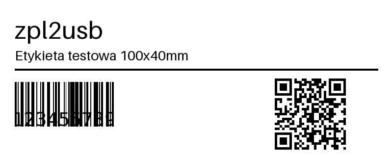

# zpl2usb

**Wirtualna sieciowa drukarka ZPL (Zebra, port 9100)** mostkująca druk na dowolną
drukarkę zainstalowaną w systemie — na Windows, Linux i macOS.

Systemy magazynowe/ERP potrafią drukować etykiety tylko na sieciową drukarkę ZPL
(port RAW/9100). zpl2usb udaje taką drukarkę: nasłuchuje na `IP_komputera:9100`,
przyjmuje strumień ZPL i kieruje go na wybraną drukarkę systemową:

- **raw** — surowe bajty ZPL 1:1 (dla drukarek natywnie ZPL, np. Zebra),
- **render** — lokalne (offline) renderowanie ZPL do bitmapy i druk przez
  sterownik systemowy (dla drukarek bez ZPL, np. Toshiba B-EX).

Aplikacja ma ikonę w zasobniku systemowym i proste okno ustawień.



## Jak to działa

```
System (WMS/ERP)  --ZPL po TCP-->  :9100 nasłuch  -->  podział na zadania (^XA…^XZ)
                                                             |
                                                        router (tryb?)
                                              raw /                    \ render
                                     druk surowy              renderer ZPL->bitmapa (DPI)
                                              \___ drukarka systemowa __/
```

## Uruchomienie ze źródeł

```bash
python3 -m venv .venv
. .venv/bin/activate           # Windows: .venv\Scripts\activate
pip install -e ".[dev]"
python -m zpl2usb              # start aplikacji (tray + nasłuch)
```

- **Windows**: dodatkowo `pip install pywin32`.
- **Linux**: wymagany CUPS (`lp`/`lpr`) oraz `python3-tk` dla GUI.
- **macOS**: CUPS jest wbudowany; `tkinter` dostarcza instalator Pythona z python.org.

## Budowa samodzielnej binarki

Na **docelowym** systemie (PyInstaller nie robi cross-kompilacji):

```bash
pip install -r requirements.txt pyinstaller
python packaging/build.py
# wynik: dist/zpl2usb  (Windows: dist/zpl2usb.exe)
```

## Konfiguracja

Zapisywana jako JSON w katalogu konfiguracji użytkownika (przez `platformdirs`,
per system). Pola mapowania:

| Pole | Znaczenie | Domyślnie |
|---|---|---|
| `listen_port` | port nasłuchu RAW | `9100` |
| `target_printer` | nazwa drukarki systemowej | — |
| `mode` | `raw` lub `render` | `raw` |
| `dpi` | 203 / 300 / 600 | `203` |
| `default_label_mm` | rozmiar etykiety, gdy brak `^PW`/`^LL` | `100 × 40` |

Model konfiguracji to lista mapowań — dziś UI obsługuje jedno, architektura jest
gotowa na wiele wirtualnych drukarek (różne porty → różne drukarki).

## Obsługiwany podzbiór ZPL (tryb render)

Renderer jest lokalny/offline i obsługuje najczęstsze polecenia:

- struktura: `^XA` `^XZ` `^FS`
- ustawienia: `^PW` `^LL` `^LH` `^CF` `^CI`
- pozycja: `^FO` `^FT`
- tekst: `^A` (font skalowalny), `^FD`
- grafika: `^GB` (ramki/linie), `^GF` (bitmapa ASCII-hex), `^FR`
- kody: `^BY`, `^BC` (Code128), `^BQ` (QR)

Nieobsługiwane polecenia są **pomijane** i trafiają do logu — reszta etykiety
renderuje się dalej. Dla drukarek natywnie ZPL używaj trybu **raw** (pełna
wierność, bez ograniczeń renderera).

## Podgląd renderu (bez drukarki)

```bash
python tools/render_zpl.py examples/sample_100x40.zpl -o podglad.png --dpi 203 --size 100x40
```

## Testy

```bash
pip install pytest
pytest
```

## Licencja

MIT. Zobacz też spec: [`docs/superpowers/specs/2026-07-11-zpl2usb-design.md`](docs/superpowers/specs/2026-07-11-zpl2usb-design.md).
